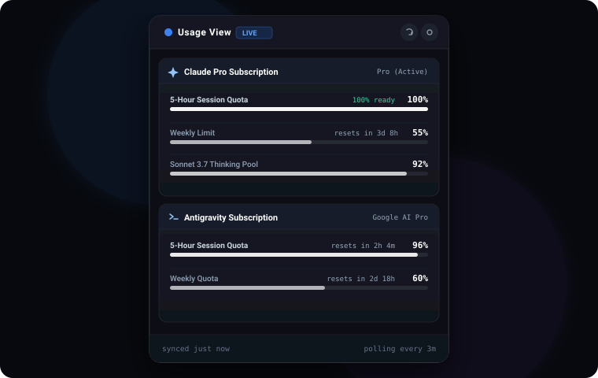
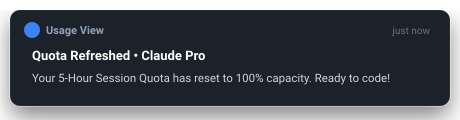

<div align="center">

# Usage View ⚡

**Ultra-lightweight Cross-Platform System Tray (Windows) & Menu Bar (macOS) Usage & Session Quota Monitor for Claude and Antigravity / Gemini.**

[](https://github.com/AdielMag/usage-view/actions/workflows/release.yml)
[](https://github.com/AdielMag/usage-view/releases)
[](https://tauri.app)
[](https://www.rust-lang.org/)
[](https://react.dev/)
[](https://www.typescriptlang.org/)
[](LICENSE)

<br/>

<p align="center">
  
</p>

<p align="center">
  <a href="#-quick-download--installation">Download Packages</a> •
  <a href="#-features">Features</a> •
  <a href="#-supported-providers--telemetry">Supported Providers</a> •
  <a href="#-desktop-notifications">Smart Notifications</a> •
  <a href="#-security--encryption">Security</a> •
  <a href="#-development--building">Build from Source</a>
</p>

</div>

---

## ⚡ Highlights

- 🪟 **Native System Tray & Menu Bar Resident**: Anchored floating tray popover on Windows & macOS. Automatically toggles on tray click, dismisses on blur or `Esc`.
- ⏱️ **Real-Time Live Countdown Timers**: Second-by-second countdown until rolling 5-Hour limits and weekly quotas restore to 100% capacity.
- 🔔 **Single-Event Reset Notifications**: Alerts you **strictly once** when your session quota is refreshed back to 100%. Fully branded under the app—never PowerShell.
- 🔍 **Zero-Config CLI Discovery**: 1-click auto-detection of local credentials from Claude Code CLI (`~/.claude.json`), Pi Agent (`~/.pi/`), and Antigravity (`~/.gemini/`).
- 🔒 **Zero-Plaintext Security**: All credentials encrypted with native OS Keyrings (**Windows Credential Manager**, **macOS Keychain**, **Linux Secret Service**).
- 🪶 **Featherweight Resource Footprint**: Built with Tauri v2 + Rust; consumes **< 15 MB RAM** in the background.

---

## 📦 Quick Download & Installation

Pre-built standalone installers and packages are published automatically on every push:

<div align="center">

| Platform | Format | Direct Download |
| :--- | :--- | :--- |
| **Windows** | `.msi` (Installer) / `.exe` (Setup) | [**Download Windows (.msi)**](https://github.com/AdielMag/usage-view/releases/latest) |
| **macOS** | `.dmg` (Universal / Apple Silicon & Intel) | [**Download macOS (.dmg)**](https://github.com/AdielMag/usage-view/releases/latest) |
| **Linux** | `.AppImage` / `.deb` | [**Download Linux (.AppImage)**](https://github.com/AdielMag/usage-view/releases/latest) |

</div>

<br/>

---

## 🔔 Smart Desktop Notifications

<div align="center">
  
</div>

Unlike standard pollers that spam alerts or route through PowerShell, **Usage View** features a purpose-built state machine:

- **100% Restored Only**: Dispatches a notification *only* when an exhausted/cooldown quota reaches 100% capacity.
- **Strict Cycle Throttling**: Records the reset epoch timestamp. Once notified, background polling cycles remain completely silent until a new usage session occurs.
- **Native OS Identity**: Registers the application AppUserModelID (`com.usageview.desktop`) and high-res icon in Windows Registry and macOS bundle metadata so toasts display directly from **Usage View**.

---

## 📖 Deep Dive & Documentation

<details>
<summary><h3>⚡ Supported Providers & Telemetry Details</h3></summary>

Usage View connects to both live cloud APIs and local developer CLI environments:

#### 1. Claude (Anthropic)
- **Claude Pro / Team / Enterprise**:
  - Live 5-Hour rolling session quota remaining (percentage and message count).
  - Exact reset timestamp and dynamic countdown timer.
  - Weekly quota usage tracking.
- **Anthropic Developer API**:
  - Rate limit telemetry via response headers: `anthropic-ratelimit-unified-5h-utilization`, `anthropic-ratelimit-unified-7d-utilization`, and retry-after cooldowns.
- **Claude Code CLI (Auto-detected)**:
  - Scans `~/.claude/.credentials.json` and `~/.claude.json` for active OAuth session tokens.

#### 2. Antigravity & Gemini (Google)
- **Antigravity CLI**:
  - Live session tracking from `~/.gemini/antigravity-cli/last_statusline_input.json`.
  - 5-Hour session quota (`gemini-5h`), Weekly quotas (`gemini-weekly`), and 3P Model pool quota.
- **Google CloudCode & AI Studio API**:
  - Live token refresh and quota summary queries against `cloudcode-pa.googleapis.com`.
- **Pi Coding Agent (Auto-detected)**:
  - Direct integration with `~/.pi/agent/auth.json`.

</details>

<details>
<summary><h3>🔒 Security Architecture & OS Keyring Storage</h3></summary>

Usage View adheres to a strict zero-plaintext security standard:

1. **Hardware-Backed Keyrings**:
   - **Windows**: Windows Credential Manager (`DPAPI` encrypted).
   - **macOS**: Apple Keychain Services (`AES-256` hardware enclave).
   - **Linux**: Freedesktop Secret Service / `dbus-keyring`.
2. **Volatile In-Memory Caching**:
   - Access tokens and OAuth refresh tokens are held in volatile memory only during active background poll cycles and never written to plain `.json` disk files.
3. **Restricted Tauri Capabilities**:
   - All IPC channels are strictly scoped via Tauri v2 ACL capabilities (`src-tauri/capabilities/default.json`).

</details>

<details>
<summary><h3>⌨️ System Tray Mechanics & Popover UX</h3></summary>

- **Tray Positioning**: Uses `@tauri-apps/plugin-positioner` to automatically calculate display coordinates and dock the popover flush against the Windows Taskbar (Bottom-Right / Top-Right) or macOS Menu Bar (Top-Right).
- **Auto-Blur Dismissal**: Clicking anywhere outside the application window immediately hides the popover into the tray.
- **Keyboard Shortcut**: Pressing <kbd>Esc</kbd> at any time immediately dismisses the active modal or docks the window.
- **Live Tray Tooltip**: Hovering over the tray icon displays a one-line summary of all monitored account percentages (e.g. `Usage View • Claude Pro: 100% | Antigravity: 96%`).

</details>

<details>
<summary><h3>🛠️ Local Development & Building from Source</h3></summary>

#### Prerequisites
- [Node.js](https://nodejs.org/) (v18 or higher)
- [Rust & Cargo](https://rustup.rs/) (v1.75 or higher)
- Build tools:
  - **Windows**: Visual Studio C++ Build Tools
  - **macOS**: Xcode Command Line Tools
  - **Linux**: `libwebkit2gtk-4.1-dev`, `libappindicator3-dev`, `librsvg2-dev`

#### 1. Clone the repository
```bash
git clone https://github.com/AdielMag/usage-view.git
cd usage-view
```

#### 2. Install dependencies
```bash
npm install
```

#### 3. Run in Development Mode
Starts the Vite development server and launches the Tauri native window with hot-reloading:
```bash
npm run tauri:dev
```

To run only the web frontend preview in your browser:
```bash
npm run dev
```

#### 4. Run Tests
```bash
cd src-tauri
cargo test
```

#### 5. Build Standalone Release
Compiles the frontend assets and builds optimized native release binaries:
```bash
npm run tauri:build
```
Output files will be generated in `src-tauri/target/release/bundle/`.

</details>

<details>
<summary><h3>🏗️ Internal Architecture & Data Flow</h3></summary>

```
┌─────────────────────────────────────────────────────────────┐
│                       OS System Tray                        │
│             (Windows Tray Icon / macOS Menu Bar)             │
└──────────────┬───────────────────────────────▲──────────────┘
               │ Click / Toggle                │ Tooltip & Status
               ▼                               │
┌──────────────────────────────────────────────┴──────────────┐
│                    Tauri v2 Core Window                     │
│               (React 19 + Tailwind CSS UI)                  │
└──────────────▲───────────────────────────────┬──────────────┘
               │ IPC Events                    │ Commands
               │ ("usage-updated")             │ (refresh, save)
┌──────────────┴───────────────────────────────▼──────────────┐
│                  Rust Backend (Tokio Async)                 │
│  ┌─────────────────────────┐   ┌──────────────────────────┐ │
│  │   Background Poller     │   │   State Notification     │ │
│  │  (1m / 3m / 5m Interval)│   │  Machine (Epoch Throttled│ │
│  └───────────┬─────────────┘   └─────────────▲────────────┘ │
│              │                               │              │
│              ▼                               │              │
│  ┌───────────────────────────────────────────┴────────────┐ │
│  │                   Adapter Registry                     │ │
│  │  ┌──────────────────────┐   ┌────────────────────────┐ │ │
│  │  │    Claude Adapter    │   │  Antigravity Adapter   │ │ │
│  │  │ (Anthropic Live API) │   │ (CloudCode / CLI JSON) │ │ │
│  │  └──────────────────────┘   └────────────────────────┘ │ │
│  └────────────────────────────────────────────────────────┘ │
└─────────────────────────────────────────────────────────────┘
```

</details>

<details>
<summary><h3>❓ Frequently Asked Questions (FAQ)</h3></summary>

**Q: How often does the app refresh quota data?**  
A: By default, Usage View polls every 3 minutes. You can adjust this to 1, 3, 5, or 15 minutes in **Preferences** (⚙️ icon).

**Q: Does Usage View send my tokens to third-party servers?**  
A: No. All requests are made directly from your machine to Anthropic (`api.anthropic.com`) or Google (`googleapis.com`). There is no intermediary analytics or telemetry server.

**Q: How do I close or exit the app completely?**  
A: Right-click the system tray icon and select **Quit Usage View**.

</details>

---

## 🤝 Contributing

Contributions, issues, and feature requests are welcome!  
Feel free to open an issue or submit a pull request on the [GitHub Repository](https://github.com/AdielMag/usage-view).

---

## 📄 License

This project is licensed under the **MIT License** - see the [LICENSE](LICENSE) file for details.
